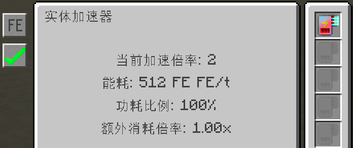

---
navigation:
  parent: introduction/index.md
  title: Entity Accelerator
  position: 5
  icon: extendedae_plus:entity_speed_ticker
categories:
  - extendedae_plus devices
item_ids:
  - extendedae_plus:entity_speed_ticker
---

# Entity Accelerator

The **Entity Accelerator** consumes energy from the AE2 network to accelerate block entities in the front block space, functioning similarly to a “Speed Torch”.

<GameScene zoom="8" background="transparent">
<ImportStructure src="../../structure/entity_speed_ticker.snbt"></ImportStructure>
</GameScene>

## Operating Mechanism

1. **Activation Requirement:** The accelerator must contain at least one **<ItemLink id="extendedae_plus:entity_speed_card" tag="{'EAS:mult':2}" />** to enable acceleration.
2. **Acceleration Effect:** Can accelerate block entities up to **1024×**.
3. **Energy Supply:** Acceleration continuously consumes AE network energy. When AE energy is insufficient, acceleration automatically pauses until energy is restored.
    - If the *Applied Flux* mod is installed, FE energy stored in network disks can be consumed to continue acceleration when AE energy is insufficient (priority configurable).
4. **Configuration Options:** Base energy consumption, entity blacklist, and per-entity energy multiplier can be adjusted via the config file.

## Energy Consumption Mechanism

### Base Energy Calculation

The energy consumption of the Entity Accelerator is determined by the base configuration value `baseCost` and the target acceleration multiplier.

Let:
- \( M \) = target multiplier (2, 4, 8, ..., 1024)
- \( B \) = base energy config (default 512)
- \( L \) = log₂(M)

**Base energy consumption formula:**

**Base Energy Reference Table (baseCost = 512)**

| Multiplier | Base Energy (AE) |
|------------|----------------|
| 2          | 256            |
| 4          | 1,024          |
| 8          | 2,048          |
| 16         | 8,192          |
| 32         | 16,384         |
| 64         | 65,536         |
| 128        | 131,072        |
| 256        | 524,288        |
| 512        | 268,435,456    |
| 1024       | 2,147,483,648 |

### Energy Card Efficiency

Installing Energy Cards reduces power consumption. The effect increases with the number of cards but has diminishing returns.

Let \( N \) = number of installed energy cards

**Energy Ratio Formula:**  

**Energy Card Efficiency Table:**

| Number of Cards | Efficiency | Actual Energy Ratio |
|----------------|------------|------------------|
| 0              | 0%         | 100%             |
| 1              | 10%        | 90%              |
| 2              | 14.5%      | 85.5%            |
| 3              | 17.15%     | 82.85%           |
| 4              | 19.0%      | 81.0%            |
| 5              | 20.21%     | 79.79%           |
| 6              | 21.15%     | 78.85%           |
| 7              | 21.9%      | 78.1%            |
| ≥8             | 50%        | 50%              |

### Final Energy Calculation

**Final Power Formula:**

**finalPower = basePower × energyRatio**

**Calculation Example:**

- Target Multiplier: 64×
- Energy Cards Installed: 3
- Base Energy: 65,536 AE
- Energy Ratio: 82.85%
- **Final Energy Consumption:** 65,536 × 0.8285 ≈ 54,267 AE

> Actual energy consumption may vary depending on entity-specific configuration.