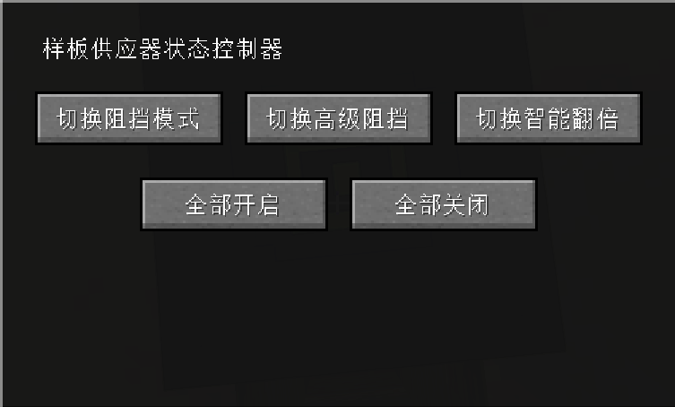

---
navigation:
  parent: introduction/index.md
  title: Pattern Provider Status Controller
  position: 3
  icon: extendedae_plus:network_pattern_controller
categories:
  - extendedae_plus devices
item_ids:
  - extendedae_plus:network_pattern_controller
---

# Pattern Provider Status Controller

<BlockImage id="extendedae_plus:network_pattern_controller" scale="5" />

The **Pattern Provider Status Controller** is a central control unit that allows you to manage the working modes of all pattern providers in your network through a single unified interface.

## User Interface & Operations

The controller UI provides the following control options:

### Mode Switching
- **Toggle Blocking Mode:** Globally enable or disable "Blocking Mode" for all pattern providers.
- **Toggle Advanced Blocking:** Globally switch "Advanced Blocking Mode."
- **Toggle Smart Multiplication:** Globally enable or disable the "Smart Multiplication" feature.

### Batch Operations
- **Enable All:** One-click to enable all three features for every pattern provider in the network.
- **Disable All:** One-click to disable all three features for every pattern provider in the network.

## How to Use
1. Place the **Pattern Provider Status Controller** in your ME network.
2. Right-click the controller to open the configuration interface.
3. Click the corresponding buttons to adjust the status of all pattern providers globally according to your management needs.

> **Note:** This controller affects **all** pattern providers in the network. To configure individual providers separately, you must still use the UI of each provider.
